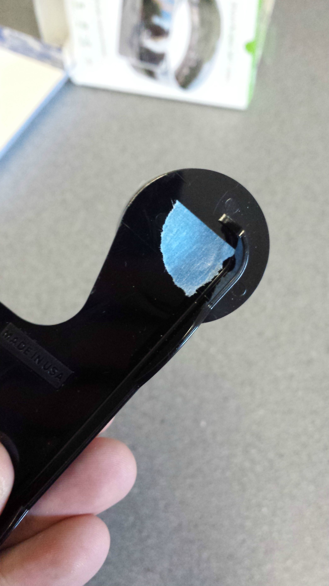
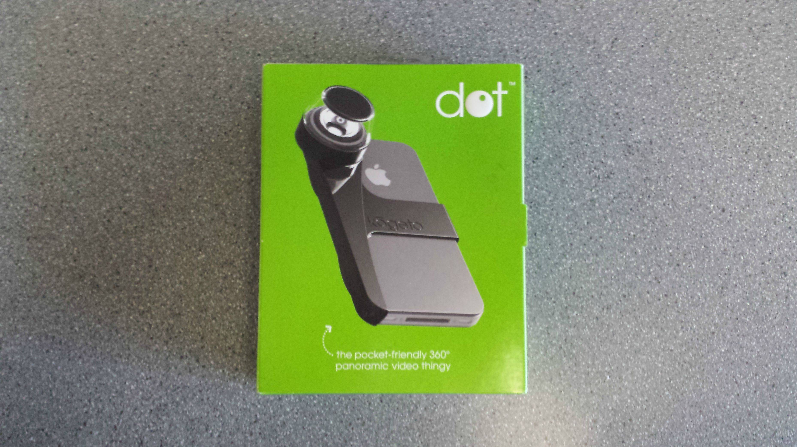
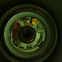

# Raspberry Pi 360° imaging with a Kogeto Dot

## Scope

This note records a historical Raspberry Pi imaging experiment using a Kogeto Dot panoramic lens. It is retained as a reference for possible future camera, inspection, or mapping work; it is not currently a project requirement.

## Optical hardware

The Kogeto Dot is a small panoramic lens intended to produce a circular image that can be transformed into a 360° view. The original experiment used an iPhone 4 version purchased at a reduced price.

The lens was protected during modification with blue tape, although another removable masking material would also work. The unnecessary portion of the lens assembly was trimmed away, and the rough edges were sanded afterwards.



*Kogeto Dot lens during modification, with blue tape used as temporary protection.*

The camera module has a fixed-focus lens. In the original setup, the focus was fixed on the centre of the lens rather than the useful outer panoramic image, so the camera had to be carefully adjusted or reseated until the captured image was acceptably focused and centred.



*Original Kogeto Dot packaging, identifying the pocket-sized 360° panoramic lens.*

## Raspberry Pi rig

The Kogeto Dot was mounted over a Raspberry Pi camera module. The physical arrangement is sensitive to the individual camera, lens, and mount, so the centre of the circular image and its usable radius must be measured from the captured image rather than assumed.

The original notes mention repeatedly reseating the camera to improve centring. The useful image boundary was kept within the captured frame so that the de-projection step would not clip the outer part of the scene.

The restored photographs are:

- `kogeto_dot.jpg` — product packaging.
- `kogeto_dot_protect.jpg` — modified lens with temporary protection.
- `raw_image_keyto_dot.jpg` — raw circular image from the Dot-mounted camera.

The raw image is retained as a calibration record before de-projection:



*Raw circular camera image before de-polar transformation. The filename is preserved as supplied; “keyto” is treated as a filename typo rather than corrected provenance.*

## Image geometry

The raw camera image is a polar representation of the surrounding scene. A de-polar transformation converts the circular image into a rectangular panoramic image.

Before processing, measure:

- the pixel coordinates of the polar-image centre;
- the radius from the usable top edge of the scene to the usable bottom edge;
- the crop or offset needed to keep the useful image inside the frame.

The values are setup-specific. They should be recorded with the camera mount and image sample whenever this experiment is repeated.

## ImageMagick workflow

The original workflow used ImageMagick's `DePolar` distortion with cubic filtering:

```text
convert test.jpg -filter Cubic -distort DePolar '555 295 1168,1087 -10,370' -resize 100x20% test.png
```

In this command, the numeric arguments encode the measured centre, radius, and output geometry for that particular camera setup. They should not be treated as universal calibration values.

## Practical lessons

- Fixed focus can be a significant limitation when the panoramic lens is mounted over a camera module.
- Mechanical centring matters: a small offset can produce uneven coverage or distortion.
- Protect the lens and camera during trimming, then remove dust and masking material before testing.
- Keep the raw image as a calibration record before applying de-projection.
- Record the camera, lens, mount position, image dimensions, centre point, radius, crop, and processing command together.
- A useful next step would be to compare the de-projected output with a known scene to estimate coverage, stitching quality, and edge distortion.

## ChartRoom relevance

This experiment may inform:

- low-cost panoramic inspection cameras;
- Raspberry Pi imaging payloads;
- visual observation around a robot or test rig;
- future 360° or wide-angle mapping experiments.

It does not establish that a Kogeto Dot is suitable for underwater use. For submerged deployment, housing, optical flat-port effects, lighting, sealing, and refraction would need separate testing.

## Provenance

- Source: user-supplied pasted text titled “2π - 360 pi cam”.
- Source content reviewed: 2026-09-22.
- Status: historical reference; technical details preserved where they are specific to the original experiment.
